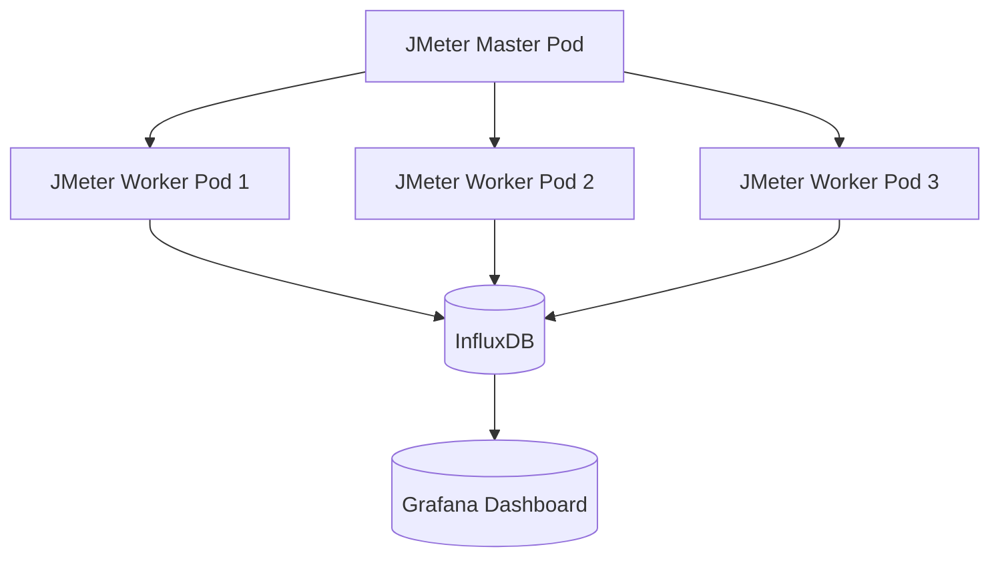

Perfect ✅ — let’s now transform this into a **Medium-ready, professionally formatted Markdown article** titled:

---

# 🧠 **Mastering JMeter Distributed Testing: Enterprise-Grade Setup, Architecture, and Deep Technical Insights**

---

> *By Santhosh Kumar J — Performance Engineering Chronicles*

---

## 🔍 **Overview**

When performance testing high-throughput systems or microservices at scale, a single JMeter node quickly reaches its limits — CPU saturation, memory exhaustion, or network bottlenecks.

That’s where **JMeter Distributed Testing** comes in. It lets you scale horizontally across multiple machines, each simulating concurrent users, coordinated by a single master controller.

In this article, we’ll go **beyond the basics** — exploring **architecture, internals, configuration, network tuning, observability integration, and troubleshooting**, just as you would design it for a real enterprise-grade performance testing setup.

---

## ⚙️ **1. What Is Distributed Testing in JMeter?**

Distributed testing means **splitting the load generation** across multiple machines to simulate a large user base efficiently.

The test execution is controlled from one **Master (Controller)** node, and multiple **Slave (Load Generator)** nodes execute the load.

### 🧩 Architecture Diagram

```mermaid
flowchart LR
  A[Controller (Master)] --> B1[Load Generator 1 (Slave)]
  A --> B2[Load Generator 2 (Slave)]
  A --> B3[Load Generator 3 (Slave)]
  B1 --> C[Target Application (SUT)]
  B2 --> C
  B3 --> C
```

### 🧠 Key Components:

* **Master Node:** Initiates test, controls synchronization, aggregates results.
* **Slave Nodes:** Execute samplers, generate load, push metrics back.
* **SUT (System Under Test):** Application endpoints or APIs under load.
* **Monitoring Stack:** InfluxDB, Prometheus, or Grafana for observability.

---

## ⚡ **2. How It Works Internally**

JMeter uses **Java RMI (Remote Method Invocation)** for coordination between the master and slave nodes.

### 🔹 Internal Workflow:

1. Master serializes the JMX test plan and sends it to all slaves via RMI.
2. Each slave deserializes and loads it into memory.
3. Slaves execute test threads in sync.
4. Each slave collects sample results and streams them back to the master.
5. Master optionally aggregates results or writes to a backend listener (InfluxDB).

### 🔹 RMI Configuration:

In `jmeter.properties`:

```properties
server.rmi.localport=4000
client.rmi.localport=4001
java.rmi.server.hostname=<slave-private-ip>
```

> 💡 **Best Practice:** Keep all nodes in the same **VPC/subnet** or under a **private VPN** to avoid RMI packet loss.

---

## 🧱 **3. Enterprise-Grade Architecture**

| **Layer**               | **Component**            | **Description**                         |
| ----------------------- | ------------------------ | --------------------------------------- |
| **Controller Layer**    | Master Node              | Orchestrates the test                   |
| **Execution Layer**     | Slave Nodes              | Execute the load                        |
| **Metrics Layer**       | InfluxDB / Prometheus    | Collects performance metrics            |
| **Visualization Layer** | Grafana                  | Dashboards for test KPIs                |
| **CI/CD Layer**         | Jenkins / GitHub Actions | Automates execution and report delivery |

---

## 🧮 **4. Advantages of JMeter Distributed Testing**

### ✅ **4.1 Horizontal Scalability**

Each slave adds compute capacity, allowing simulation of **10,000+ virtual users**.

| Setup    | Threads per Node | Total Threads |
| -------- | ---------------- | ------------- |
| 1 Node   | 1,000            | 1,000         |
| 5 Nodes  | 1,000            | 5,000         |
| 10 Nodes | 1,000            | 10,000        |

---

### ✅ **4.2 Realistic Geo-Traffic Simulation**

Deploy slaves in multiple regions (e.g., `ap-south`, `us-east`, `eu-west`) to mimic real-world latency and CDN behavior.

---

### ✅ **4.3 Centralized Control**

The master node:

* Starts/stops all slaves in sync.
* Aggregates or forwards metrics.
* Ensures repeatability across runs.

---

### ✅ **4.4 Observability Integration**

Use InfluxDB + Grafana or Prometheus for real-time visibility of:

* Active threads
* Request rate (TPS)
* Response times (P90, P95)
* Error % and response codes
* Node resource metrics

Example InfluxDB Listener Config:

```properties
backend_influxdb.url=http://influxdb:8086/write?db=jmeter
backend_influxdb.metrics_sender=org.apache.jmeter.visualizers.backend.influxdb.HttpMetricsSender
backend_influxdb.application=BankingAPI
```

---

## ⚠️ **5. Disadvantages and Real-World Challenges**

### ❌ **5.1 Network Dependency**

* JMeter uses TCP-based RMI.
* Even a 100ms latency can desynchronize test start/stop.

**Fix:**

* Use static RMI ports.
* Keep all nodes within 1 Gbps network (LAN/VPC).

---

### ❌ **5.2 Synchronization Drift**

Without synchronized system clocks, thread start times differ.

**Fix:**

```bash
sudo apt install ntp
sudo systemctl enable ntp
```

---

### ❌ **5.3 Result Aggregation Bottleneck**

Master can run out of heap while merging data.

**Best Practice:**

* Disable GUI-based aggregation.
* Use Backend Listener (InfluxDB, Prometheus, or CSV).

---

### ❌ **5.4 Test Data Duplication**

Each slave needs identical CSV or payload data.

```bash
rsync -avz data/ slave1:/opt/jmeter/data/
rsync -avz data/ slave2:/opt/jmeter/data/
```

---

### ❌ **5.5 Plugin / Version Mismatch**

All nodes must have:

* Same JMeter version
* Same Java version
* Same plugin versions

Mismatch causes serialization errors:

```
java.rmi.UnmarshalException: Error unmarshalling return
```

---

## 🔧 **6. Setup and Configuration (AWS Example)**

### 🧰 **Pre-Requisites**

* All nodes have JMeter 5.6.3 + Java 17
* Firewall open for ports `1099`, `4000–4005`
* NTP enabled for clock sync

### ⚙️ **Steps**

#### Step 1 — Start the Slave Nodes:

```bash
./jmeter-server -Dserver.rmi.localport=4000
```

#### Step 2 — Validate Connectivity:

```bash
telnet <slave-ip> 1099
```

#### Step 3 — Run Distributed Test:

```bash
jmeter -n -t test_plan.jmx -R 10.0.0.2,10.0.0.3,10.0.0.4 -l results.jtl
```

#### Step 4 — Push Results to InfluxDB:

```bash
jmeter -n -t test_plan.jmx -R 10.0.0.2,10.0.0.3 -Jbackend_influxdb.url=http://influxdb:8086/write?db=jmeter
```

---

## 📊 **7. Monitoring Stack — InfluxDB + Grafana Integration**

### ✅ **JMeter → InfluxDB**

Each slave reports to InfluxDB backend listener:

```properties
backend_influxdb.url=http://influxdb:8086/write?db=jmeter
backend_influxdb.application=ECommerceAPI
```

### ✅ **Prometheus → Node Exporter**

Each slave exports CPU, RAM, Disk, Network metrics:

```bash
docker run -d --net="host" prom/node-exporter
```

### ✅ **Grafana Dashboards**

Panels:

* Load per node
* TPS and error trends
* JVM memory usage
* CPU per slave node
* Response time distribution

---

## 🧩 **8. Common Failure Scenarios and Fixes**

| **Symptom**                 | **Root Cause**                | **Fix**                               |
| --------------------------- | ----------------------------- | ------------------------------------- |
| `Connection refused to RMI` | Firewall / port blocked       | Open TCP 1099 and 4000–4005           |
| Test hangs at 0%            | Network latency / clock drift | Use NTP & same region                 |
| Missing CSV file            | Data not synced to slave      | Use rsync or S3 sync                  |
| OutOfMemoryError            | Large result aggregation      | Increase heap or use backend listener |
| Plugin not found            | Mismatch plugin version       | Sync via JMeter Plugin Manager CLI    |

---

## ⚙️ **9. Best Practices for Production-Grade Distributed Testing**

### 🔹 Configuration

* Keep heap size 2–6 GB on each slave (`HEAP="-Xms2g -Xmx6g"`)
* Disable listeners in test plan (use backend metrics only)
* Use non-GUI mode only
* Enable remote logging

### 🔹 Network

* Place all nodes in same subnet
* Use static IPs or DNS-based names
* Disable reverse DNS lookup in `jmeter.properties`

### 🔹 Automation

* Use **Ansible** or **Terraform** to deploy nodes
* Use **Jenkins** to trigger distributed runs:

  ```bash
  jmeter -n -t test_plan.jmx -R $(cat slaves.txt | tr '\n' ',')
  ```

### 🔹 Observability

* Integrate JMeter + Grafana for live analysis
* Correlate system metrics (CPU/Memory/IO) with load metrics

---

## 🧠 **10. Decision Framework — When to Use Distributed Testing**

| **Scenario**                  | **Recommended?** | **Reason**               |
| ----------------------------- | ---------------- | ------------------------ |
| Load < 1000 users             | ❌ No             | Single node enough       |
| 1000–10,000 users             | ✅ Yes            | Scale-out needed         |
| Multi-region simulation       | ✅ Yes            | Realistic latency        |
| Corporate network (firewalls) | ⚠️ Maybe         | Needs static port setup  |
| Cloud execution (EC2/K8s)     | ✅ Yes            | Simplified orchestration |

---

## 🔩 **11. Modern Alternatives**

| **Approach**             | **Description**                      | **Example Tools**                 |
| ------------------------ | ------------------------------------ | --------------------------------- |
| **Kubernetes Pods**      | JMeter master & slaves as containers | JMeter Operator / Helm            |
| **Cloud-native SaaS**    | Managed JMeter environment           | BlazeMeter / OctoPerf / RedLine13 |
| **Serverless Execution** | Fargate or Lambda-based runners      | AWS ECS, Azure Container Apps     |

---

## 🧰 **12. Sample Enterprise Script**

**`start_distributed.sh`**

```bash
#!/bin/bash
MASTER_IP="10.0.0.1"
SLAVES=("10.0.0.2" "10.0.0.3" "10.0.0.4")
JMX="scripts/test_plan.jmx"
LOG="results/results_$(date +%F_%H-%M).jtl"

echo "Syncing data files..."
for SLAVE in "${SLAVES[@]}"; do
  rsync -avz data/ $SLAVE:/opt/jmeter/data/
done

echo "Starting distributed test..."
jmeter -n -t $JMX -R $(IFS=,; echo "${SLAVES[*]}") -l $LOG
```

---

## 🧾 **13. Final Summary**

| **Aspect**        | **Advantages**              | **Disadvantages**          |
| ----------------- | --------------------------- | -------------------------- |
| **Scalability**   | Simulates 10K+ users easily | Requires infra setup       |
| **Flexibility**   | Supports any topology       | Network dependent          |
| **Control**       | Centralized orchestration   | RMI synchronization lag    |
| **Observability** | Integrates with Grafana     | Additional setup           |
| **Automation**    | CI/CD integration possible  | Setup maintenance overhead |

---

## 🧩 **14. Pro-Tier Architecture — JMeter + Kubernetes**



**Benefits:**

* Dynamic scaling via Helm
* Automatic pod recovery
* Stateless worker lifecycle
* Cloud-native CI/CD integration

---

## 🧠 **15. Conclusion**

Distributed testing with JMeter isn’t just about adding more machines — it’s about **engineering load orchestration at scale**.
When properly tuned, it delivers **massive concurrency**, **observability**, and **production-level realism** in your non-functional testing strategy.

But it also demands discipline:

* synchronized clocks
* consistent data
* stable networking
* version parity

Master these — and your distributed JMeter setup becomes a **load-generation powerhouse** capable of handling millions of virtual users.

---

