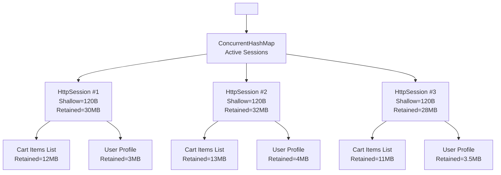

## 🧠 1. What Is a Heap Dump?

A **heap dump** is a snapshot of all live objects in the JVM heap memory at a specific time — including class instances, arrays, references, and object graphs.
It’s primarily used for diagnosing **memory leaks**, **object retention**, and **GC inefficiency**.

---

## 🧩 2. Two Key Concepts: Shallow Heap vs Retained Heap

| Concept           | Meaning                                                                                                                              | Typical Use                                                                 |
| ----------------- | ------------------------------------------------------------------------------------------------------------------------------------ | --------------------------------------------------------------------------- |
| **Shallow Heap**  | Memory consumed **directly by the object itself** (its own fields and internal structure).                                           | To estimate object’s immediate footprint.                                   |
| **Retained Heap** | Total memory that would be **freed if this object were garbage collected**, including all objects that are *reachable only* from it. | To identify objects retaining large portions of the heap (potential leaks). |

---

## 🔍 3. Understanding Shallow Heap

**Definition:**
The **Shallow Heap** is the size of the memory allocated for the object itself — *not including other objects it references*.

* It depends on:

  * Object header (typically 8 or 16 bytes, depending on JVM bitness and compression)
  * Instance fields (primitive + reference fields)
  * Array length (if it’s an array)

**Example:**

```java
class Customer {
   int id;              // 4 bytes
   String name;         // reference = 4 or 8 bytes
   double balance;      // 8 bytes
}
```

A `Customer` object:

* Object header: 12–16 bytes
* int + double + reference: 4 + 8 + 4 = 16 bytes
* **Total Shallow Heap ≈ 32 bytes**

✅ *But note*: The `String name` object is not included — only the reference pointer is.

---

## 🕸️ 4. Understanding Retained Heap

**Definition:**
The **Retained Heap** is the total memory that will be **freed when the object and all objects exclusively reachable from it** are garbage collected.

That means:
→ If object A references object B and B is not referenced by anything else, then A “retains” B.

**Example:**

```java
Customer c1 = new Customer();
c1.name = new String("John Doe");
```

* Shallow Heap of `c1` = ~32 bytes
* Shallow Heap of `String("John Doe")` = ~40 bytes
* **Retained Heap of `c1` = 32 + 40 = 72 bytes**

If we delete the reference `c1`, both `Customer` and `String` become unreachable → 72 bytes freed.

---

## ⚙️ 5. Real-World Example (Eclipse MAT Output)

| Object                        | Shallow Heap | Retained Heap    | Dominator      |
| ----------------------------- | ------------ | ---------------- | -------------- |
| `com.app.CacheManager@1a2b3c` | 80 bytes     | 45,000,000 bytes | `<GC Root>`    |
| `com.app.UserSession@4b5c6d`  | 32 bytes     | 120,000 bytes    | `CacheManager` |
| `java.util.HashMap@5e6f7g`    | 64 bytes     | 40,000,000 bytes | `CacheManager` |

🧩 *Interpretation:*
Even though each object individually is small, `CacheManager` indirectly holds references to many large collections, giving it a **retained heap of 45 MB** — a classic **memory retention issue**.

---

## 🧮 6. Memory Retention and Leak Analysis

### 📍 When Retained Heap Is More Important:

* You want to know **which object prevents garbage collection** of others.
* It reveals the **dominators** in the object graph (those that “own” memory).

### 🕳️ Memory Leak Detection Steps:

1. Open the heap dump in **Eclipse MAT**.
2. Use **“Dominator Tree”** view.
3. Sort by **Retained Heap**.
4. Look for large retained sizes where Shallow Heap is small → potential **leaks**.

**Example Pattern:**

```
Class Name                 Shallow Heap   Retained Heap
---------------------------------------------------------
com.app.CacheManager       80 B           45 MB
java.util.HashMap          64 B           40 MB
java.lang.String[]         16 KB          35 MB
```

👉 Indicates cached objects not being cleared — a **leak suspect**.

---

## 🧩 7. Relationship Between Both

```
Retained Heap = Shallow Heap + Sum(Shallow Heaps of all uniquely referenced objects)
```

In visualization:

```
Object A (32B)
  ↳ Object B (40B)
      ↳ Object C (24B)
```

* A’s Shallow Heap = 32B
* B’s Shallow Heap = 40B
* C’s Shallow Heap = 24B
* A’s Retained Heap = 32 + 40 + 24 = 96B

If any other root references B or C, they are no longer *uniquely retained* by A, so they’re excluded from A’s retained heap.

---

## 🧭 8. Tools That Display These Metrics

| Tool            | How It Displays                                                         |
| --------------- | ----------------------------------------------------------------------- |
| **Eclipse MAT** | Dominator Tree, Leak Suspect Report (both show Shallow & Retained Heap) |
| **JProfiler**   | Heap Walker → “References” tab shows retained set                       |
| **VisualVM**    | “Classes” tab → retained size when expanding reference tree             |
| **YourKit**     | Object Explorer → shows retained memory per instance                    |

---

## 🧩 9. Real Case Study

A production heap dump showed:

```
org.springframework.web.HttpSessionMap$Entry[]
Shallow Heap: 256 bytes
Retained Heap: 600 MB
```

**Diagnosis:**

* The array was small (shallow heap low),
* But referenced large cached session data (retained heap massive),
* Root cause: Session cleanup job was disabled after release.

**Fix:** Enable session eviction and introduce TTL-based cache cleanup.

---

## 🚀 10. Summary Table

| Parameter      | Shallow Heap                     | Retained Heap                                                       |
| -------------- | -------------------------------- | ------------------------------------------------------------------- |
| Definition     | Memory used by the object itself | Memory freed if object and all uniquely referenced objects are GC’d |
| Includes       | Object header + fields           | Entire subgraph of uniquely referenced objects                      |
| Helps Identify | Object size                      | Memory retention / leaks                                            |
| Visible In     | All heap analysis tools          | Dominator Tree view                                                 |
| Key Use Case   | Object footprint                 | Leak suspects, memory ownership                                     |

---

## 🧠 Key Insight:

> A **memory leak** doesn’t always mean an increase in shallow heap — it’s the **retained heap** that reveals *why memory isn’t freed*.

---


## ✅ **1. Simple Object Graph – Shallow vs Retained Heap**

graph TD
    ROOT["<GC Root>"] --> MAP["ConcurrentHashMap - Active Sessions"]
    MAP --> S1["HttpSession #1 | Retained = 30MB"]
    MAP --> S2["HttpSession #2 | Retained = 32MB"]
    MAP --> S3["HttpSession #3 | Retained = 28MB"]
    S1 --> CART1["Cart Items List | 12MB"]
    S2 --> CART2["Cart Items List | 13MB"]
    S3 --> CART3["Cart Items List | 11MB"]
    S1 --> USER1["User Profile | 3MB"]
    S2 --> USER2["User Profile | 4MB"]
    S3 --> USER3["User Profile | 3.5MB"]


| Object     | Shallow Heap | Retained Heap          |
| ---------- | ------------ | ---------------------- |
| `Customer` | 32B          | 32 + 40 + 24 = **96B** |
| `String`   | 40B          | 40 + 24 = **64B**      |
| `char[]`   | 24B          | 24B                    |

📝 Meaning → Deleting `Customer` frees **96B** because ALL dependent objects are *uniquely reachable* through it.

---

## ✅ **2. Real Leak Example – Web Session Leak (Spring / Tomcat)**

### ❌ Root Cause: User HTTP sessions stored in a map → never expired



| Object               | Shallow Heap | Retained Heap           |
| -------------------- | ------------ | ----------------------- |
| `HttpSession` (each) | 120B         | **30MB+**               |
| `ConcurrentHashMap`  | ~2KB         | **90MB+**               |
| `UserCartItem[]`     | 24KB         | **12MB**                |
| Whole leak impact    | ~3 KB        | **100+ MB retained** 😬 |

⭕ **Observation**:
The map (`ConcurrentHashMap`) is tiny (shallow), but **dominates 90+MB retained heap** because sessions never expired.

---

## ✅ **3. MAT Dominator Tree View for This Leak**

```
Class Name                               Shallow Heap      Retained Heap
---------------------------------------------------------------------------
java.util.concurrent.ConcurrentHashMap     2,048 B          98,420,112 B   👈 leak root
 |- org.apache.catalina.session.StandardSession 120 B       32,400,000 B
 |- org.apache.catalina.session.StandardSession 120 B       31,900,000 B
 |- org.apache.catalina.session.StandardSession 120 B       30,100,000 B
```

📌 **Red Flag Pattern**
✅ Shallow heap **low**
✅ Retained heap **very high**
✅ Not cleared → memory leak

---

## ✅ **4. Why Retained Heap Exposes the Leak (Not Shallow Heap)**

```
If you sorted objects by Shallow Heap → nothing looks abnormal.
If you sort by Retained Heap → 90% of memory owned by 1 object → 🚨 leak detected.
```

---

## ✅ **5. Fix Strategy for the Leak**

| Issue                               | Fix                                                      |
| ----------------------------------- | -------------------------------------------------------- |
| Sessions not expiring               | Enable session timeout (web.xml or Spring Boot property) |
| Large cart object stored in session | Move to distributed cache (Redis) or DB                  |
| Map used as cache with no eviction  | Add TTL (Guava, Caffeine, EHCache)                       |
| No cleanup thread                   | Add `@Scheduled` cleanup or container-managed eviction   |

---

## ✅ **6. One-Line Definition Recap**

| Term              | Definition                                            |
| ----------------- | ----------------------------------------------------- |
| **Shallow Heap**  | Memory owned by *just that object*                    |
| **Retained Heap** | Memory freed if object + its dependent graph are GC’d |
| **Leak Root**     | Object with small shallow heap but huge retained heap |

---


